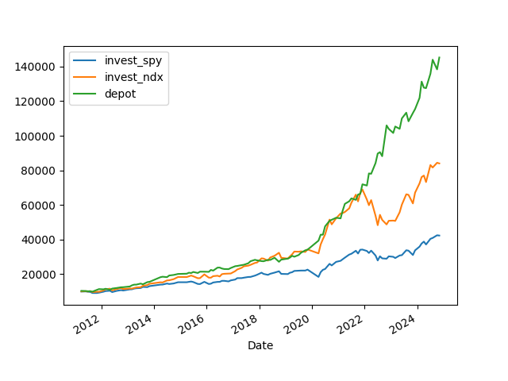

# Ergebnisse von Fama und French zur Entwicklung einer Momentum-Portfolio-Strategie

### Einführung

Eugene Fama und Kenneth French haben in ihren Forschungen zur Kapitalmarkteffizienz und Anomalien wichtige Beiträge geleistet. Insbesondere ihre Arbeiten zum Momentum-Effekt haben gezeigt, dass Aktien mit hoher Rendite in der Vergangenheit tendenziell auch in Zukunft höhere Renditen erzielen[1][2].

### Momentum-Effekt

Der Momentum-Effekt beschreibt die Tendenz, dass Aktien, die in der Vergangenheit hohe Renditen erzielt haben, auch in Zukunft höhere Renditen erzielen. Dieser Effekt ist robust und wurde in verschiedenen Studien bestätigt[2][4].

### Risikoadjustierung

Fama und French haben gezeigt, dass der Momentum-Effekt durch eine Risikoadjustierung auf Portfolioebene gemäß des Fünf-Faktor-Modells erklärt werden kann. Dieses Modell berücksichtigt neben dem Marktrisiko auch die Unternehmensgröße (Size), Value, Profitabilität und Investment[4].

### Ergebnisse

Die Ergebnisse von Fama und French zeigen, dass der Momentum-Effekt durch eine Risikoadjustierung auf Aktienebene eliminiert werden kann. Dies bedeutet, dass die Profitabilität der Momentum-Strategien größtenteils verschwindet, wenn man die Risiken auf Aktienebene berücksichtigt[4].

### Fazit

Die Forschungen von Fama und French haben gezeigt, dass der Momentum-Effekt eine wichtige Anomalie am Kapitalmarkt darstellt. Durch eine Risikoadjustierung auf Aktienebene kann dieser Effekt jedoch eliminiert werden. Dies hat wichtige Implikationen für die Entwicklung von Momentum-Portfolio-Strategien.

### Anwendung in der Praxis
Der in diesem Falle entwickelte Algorithmen konnte auf Grundlage dieser Strategie den S&P 500 sowie den NASDAQ 100 outperformen.

| Jahr    |               01   |               02   |               03   |               04   |               05   |               06   |               07   |               08   |               09   |               10   |               11   |               12   |     Mittel        |
|:--------|-------------------:|-------------------:|-------------------:|-------------------:|-------------------:|-------------------:|-------------------:|-------------------:|-------------------:|-------------------:|-------------------:|-------------------:|------------------:|
| 11      |               0.62 |               2.82 |               0.69 |               2.04 |               0.38 |              -2.10 |              -1.42 |              -4.10 |              -7.61 |               8.87 |               4.55 |               3.79 |              0.71 |
| 12      |               4.93 |               1.85 |               3.21 |               1.05 |              -0.04 |               3.25 |               0.85 |               4.55 |               2.64 |               3.66 |               1.57 |               1.33 |              2.40 |
| 13      |               5.15 |               3.76 |               6.10 |               2.01 |               5.85 |               0.43 |               5.12 |              -5.26 |               3.20 |               3.03 |               1.27 |               3.09 |              2.81 |
| 14      |              -2.74 |                    |               3.71 |              -1.46 |               1.93 |               2.25 |              -3.37 |               0.00 |              -1.29 |               4.77 |              -1.88 |               1.17 |              0.28 |
| 15      |              -3.52 |               3.71 |              -2.67 |              -0.26 |               1.26 |              -3.88 |             nan    |              -5.38 |                    |               6.25 |               1.62 |              -2.98 |             -0.58 |
| 16      |               2.22 |              -0.64 |               7.35 |              -2.14 |               4.17 |              -1.29 |               6.40 |               2.86 |              -0.23 |              -0.20 |              -0.05 |               4.35 |              1.90 |
| 17      |              -0.06 |               3.38 |              -0.41 |               2.51 |               0.15 |               0.42 |              -0.29 |               0.13 |               1.74 |               1.36 |               1.32 |              -1.27 |              0.75 |
| 18      |               0.91 |              -0.24 |              -3.00 |               2.40 |               1.26 |              -1.44 |               1.38 |               1.41 |              -0.54 |              -2.66 |               4.50 |             -12.16 |             -0.68 |
| 19      |              11.22 |               3.09 |               0.76 |               4.26 |              -0.74 |               6.63 |              -3.39 |               3.88 |               5.30 |               1.10 |               5.11 |               1.61 |              3.24 |
| 20      |              -2.72 |             -13.23 |             nan    |              15.89 |               7.94 |              -0.82 |               4.77 |               4.07 |              -1.81 |               0.81 |              14.85 |               1.06 |              2.80 |
| 21      |              -2.64 |              -0.01 |               4.72 |               5.14 |               1.61 |              -0.70 |               4.17 |               1.00 |              -4.27 |               4.43 |               0.83 |               6.03 |              1.69 |
| 22      |              -1.24 |              -4.58 |               8.23 |              -4.09 |               7.05 |              -9.19 |              11.21 |              -3.32 |                    |              11.20 |               6.73 |              -5.05 |              1.54 |
| 23      |               6.79 |              -4.60 |               4.30 |               1.49 |              -6.36 |              15.57 |               4.28 |              -3.76 |              -2.54 |              -5.78 |               7.45 |               7.27 |              2.01 |
| 24      |               0.09 |               3.73 |               6.76 |              -3.27 |               4.35 |               0.68 |               6.12 |               5.15 |               1.41 |               0.12 |                    |                    |              2.51 |
| Mittel |               1.36 |              -0.07 |               3.06 |               1.83 |               2.06 |               0.70 |               2.76 |               0.09 |              -0.33 |               2.64 |               3.68 |               0.63 |              1.53 |

### Quellen

[1] https://de.wikipedia.org/wiki/Kapitalmarktanomalie
[2] https://alphaarchitect.com/2022/10/momentum-factor-investing-30-years-of-out-of-sample-data/
[3] https://alphaarchitect.com/2015/12/quantitative-momentum-investing-philosophy/
[4] https://mba.tuck.dartmouth.edu/pages/faculty/ken.french/data_library.html
[5] https://www.institutional-money.com/magazin/theorie-praxis/artikel/ein-faktor-loest-sich-auf-62844

Citations:
[1] https://de.wikipedia.org/wiki/Kapitalmarktanomalie
[2] https://alphaarchitect.com/2022/10/momentum-factor-investing-30-years-of-out-of-sample-data/
[3] https://mba.tuck.dartmouth.edu/pages/faculty/ken.french/data_library.html
[4] https://www.institutional-money.com/magazin/theorie-praxis/artikel/ein-faktor-loest-sich-auf-62844

